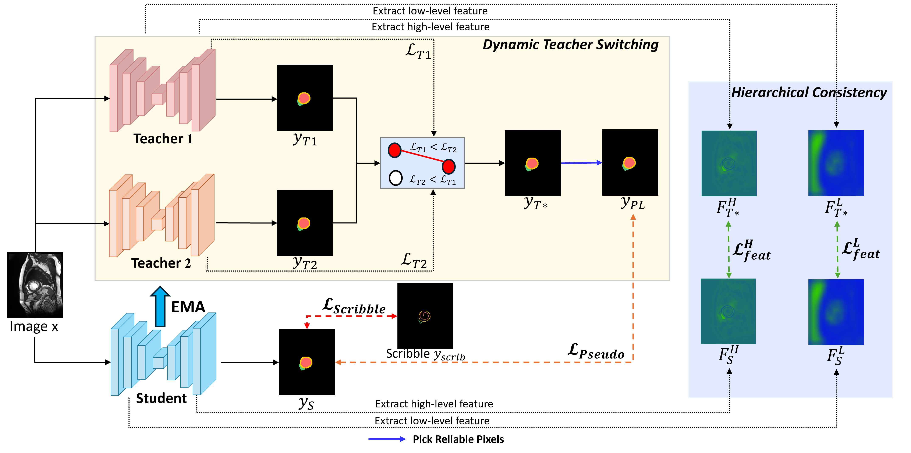

# SDT-Net: Dynamic Teacher Switching with Hierarchical Consistency for Scribble-Supervised Medical Image Segmentation


# Datasets
### ❤️ ACDC Dataset
- Mask Annotations: [ACDC](https://www.creatis.insa-lyon.fr/Challenge/acdc/) 
- Scribble annotations: [ACDC scribbles](https://vios-s.github.io/multiscale-adversarial-attention-gates/data)
### 🫀 MSCMR Dataset
- Mask Annotations: [MSCMRseg](https://zmiclab.github.io/zxh/0/mscmrseg19/data.html)
- Scribble annotations: [MSCMR_scribbles](https://github.com/BWGZK/CycleMix/tree/main/MSCMR_scribbles)
- Scribble-annotated dataset for training: [MSCMR_dataset](https://github.com/BWGZK/CycleMix/tree/main/MSCMR_dataset). 

> We have reorganized the datasets, and they are now available for download at: 👉 [Google Drive](https://drive.google.com/drive/folders/1OCPCEKdMr7Gh9v7xhSY5c_HF1e0TRkDL?usp=sharing)

# Setup
This code has been test with Python 3.10.18:
Create environment:
```bash
conda create -n env python=3.10.18
conda activate env
```

Install packages:

```bash
pip install -r requirements.txt
```
# Usage
For training:

```bash
cd code/train
bash run.sh
```

For testing:
```bash
cd code/test
python test_acdc.py # for ACDC dataset
python test_mscmr.py # for MSCMRseg dataset
```

### ⚙️ Configuration
The `run.sh` file contains several configurable parameters for training experiments, such as:
- Dataset path and type (e.g., ACDC, MSCMR)
- Training hyperparameters like learning rate, batch size, and total iterations
- Experimental settings such as seed, GPU index, and supervision type (e.g., scribble)
You can modify these arguments in `run.sh` to adjust the training setup for your experiments.

# Project Structure
```
├── 📁 code
│   ├── 📁 dataloader
│   │   ├── __init__.py
│   │   ├── acdc.py
│   │   └── mscmr.py
│   ├── 📁 networks
│   │   ├── __init__.py
│   │   ├── net_factory.py
│   │   └── unet.py
│   ├── 📁 test
│   │   ├── test_mscmr.py
│   │   ├── test_acdc.py
│   │   └── utils.py
│   ├── 📁 train
│   │   ├── __init__.py
│   │   ├── run.sh
│   │   ├── train_method_acdc.py
│   │   └── train_method_mscmr.py
│   ├── 📁 utils
│   │   ├── __init__.py
│   │   ├── ema_optim.py
│   │   ├── losses.py
│   │   ├── pick_reliable_pixels.py
│   │   └── ramps.py
│   └── val.py
|
├── 📁 data
│   ├── 📁 ACDC
│   ├── 📁 MSCMR
|
├── 📝 README.md
└── 📄 requirements.txt
```

# Acknowledgement
We gratefully acknowledge the public release of [WSL4MIS](https://github.com/HiLab-git/WSL4MIS) and [CycleMix](https://github.com/BWGZK/CycleMix) for part of their codes, processed datasets and data splits.
